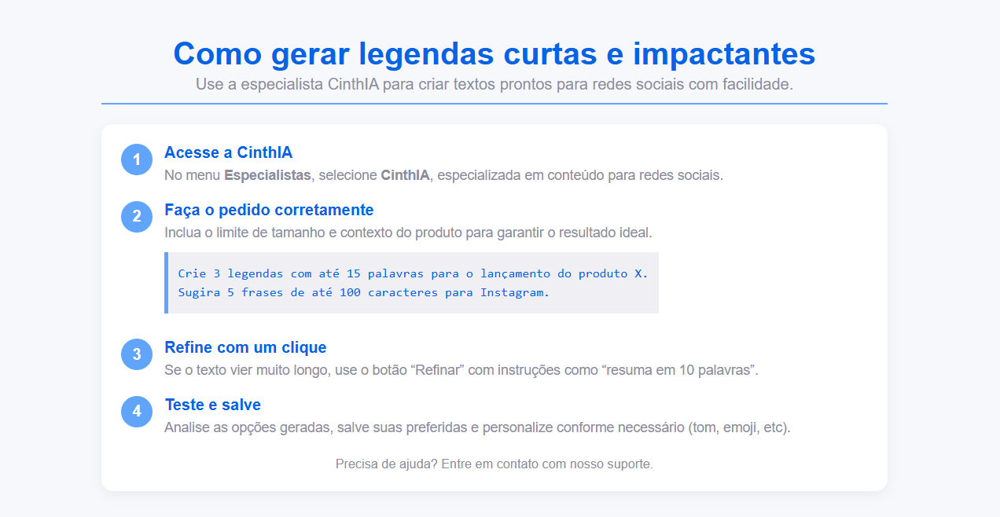

# FAQ — Team4You (Base de Conhecimento)



Este projeto é uma página de FAQ (perguntas frequentes) interativa desenvolvida em **HTML e CSS**, destinada a fornecer instruções passo a passo sobre como gerar legendas curtas e impactantes usando a especialista **CinthIA**.

## 🔹 Funcionalidades

* Layout limpo, moderno e centralizado.
* Cards para destaque visual de cada etapa.
* Lista numerada de passos com destaque visual em círculo.
* Seção de exemplos de uso.
* Rodapé com informações de suporte.

## 🖌️ Tecnologias Utilizadas

* HTML5
* CSS3 (variáveis CSS, flexbox e sombras)

## ⚙️ Estrutura do Projeto

```
index.html
assets/preview.png
```

### Principais Seções

1. **Header**: título e descrição da página.
2. **Card de Passos**: cada passo numerado com título, descrição e exemplos.
3. **Rodapé**: mensagem de suporte.

## 📝 Exemplo de Uso

No passo 2, para criar legendas curtas:

```text
Crie 3 legendas com até 15 palavras para o lançamento do produto X.
Sugira 5 frases de até 100 caracteres para Instagram.
```

## 🎨 Estilo Visual

* **Cores principais**: azul escuro (#0664e4), azul médio (#60a5fa), cinza (#8c8c9c), branco (#fff).
* **Tipografia**: Arial, sans-serif.
* **Layout**: flexbox, cards com sombras e bordas arredondadas.

## 🚀 Como Executar

1. Clone ou baixe este repositório.
2. Abra o arquivo `index.html` em qualquer navegador moderno.
3. A página estará funcional localmente.

## 💡 Melhorias Futuras

* Responsividade completa para dispositivos móveis.
* Interatividade via JavaScript (animação de passos).
* FAQ dinâmico com backend e armazenamento de dados.
